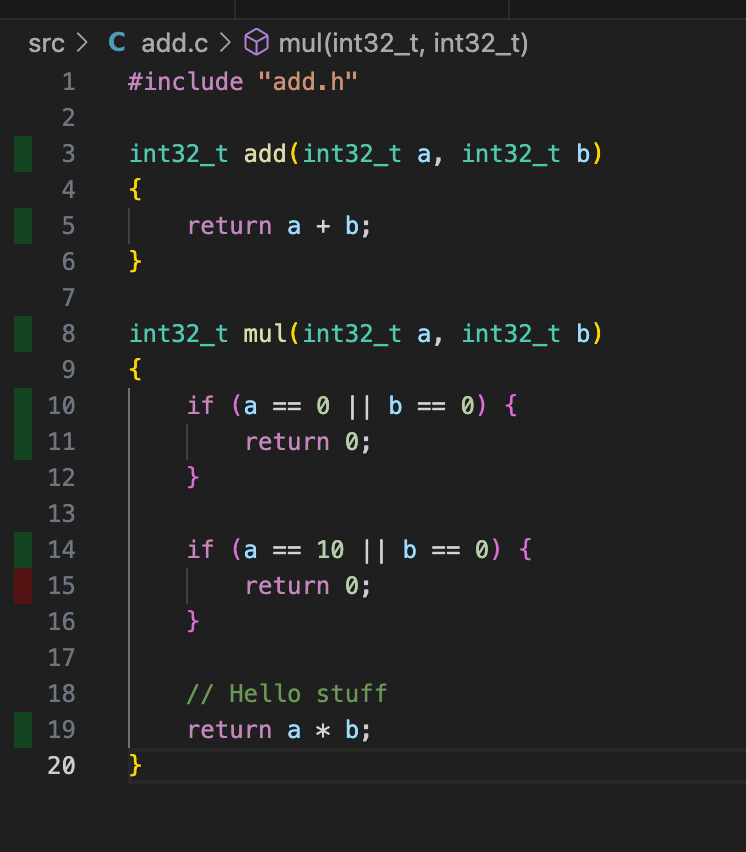

# c-code-coverage
Example repo that show how to generate code coverage in C with two different methods

* gcov/lcov: gcc/clang instruments the binary that generates a .gcda when the binary is run and lcov can convert to coverage report
* kcov: Used debug symboles to place breakpoints in the binary and collect coverage and generate a coverage report

## MacOS

``` bash
brew install lcov
brew install kcov
```

## Linux
``` bash
apt install build-essential # Be able to compile c code
apt install lcov # Used for gcov/lcov 
apt install kcov # Used for kcov
```

## Build with coverage
``` bash
cd src
make lcov
make kcov # Not working on macOS at the moment for some reason
```

## VSCode

[coverage-gutters](https://marketplace.visualstudio.com/items?itemName=ryanluker.vscode-coverage-gutters)



## Links

* https://gcovr.com/en/5.1/guide/compiling.html